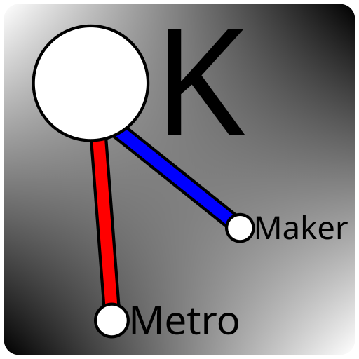

# KMetroMaker

KMetroMaker is an offline Pygame-based metro map making tool.

## Prerequisites

You will need:

- Python 3
- PyGame
- Tkinter

## Configuration

KMetroMaker uses a `config.toml` file, although if it is not present it will just use the `default.toml` file from the resources directory. Feel free to change the former.

## Usage

### Stations

#### Creating Stations

To make a station, click while holding down `Alt`+`S`. A prompt will appear asking you for the station name. Type in your preferred station name, and press OK. Your station should appear on the map.

#### Removing Stations

To remove a station, click on a station while holding down `Alt`+`S`+`R`. A prompt will ask you if you are sure you want to remove the station. Press the corresponding button.

#### Renaming Stations

To rename a station, click on a station while holding down `Alt`+`S`+`N`. A prompt will appear asking you for the new station name. Type in your new station name, and press OK. Your station's new name should appear on the map.

### Connections

#### Creating Connections

<!-- note: NOT ROBLOX CONNECTIONS!!! !-->
To make a connection between two stations, click two stations while holding down `Alt`+`C`. A prompt will ask you for the color. Depending on your configuration, you can use `#xxxxxx` if `hexCompatible` is enabled, and you can use colors from the palette defined in `paletteColors` if the color input starts with `$`.

#### Removing Connections

To remove a connection between two stations, click two stations that have a connection while holding down `Alt`+`C`+`R`. A prompt will ask you if you want to remove the connection between those two stations. Press the corresponding button.

#### Recoloring Connections

To recolor a connection between two stations, click two stations that have a connection while holding down `Alt`+`C`+`N`. A prompt will ask you for the new connection color. Type in the corresponding color.

### Rivers

#### Creating Rivers

To make a river, click two places while holding down `Alt`+`V`. A prompt will ask you for the color. Depending on your configuration, you can use `#xxxxxx` if `hexCompatible` is enabled, and you can use colors from the palette defined in `paletteColors` if the color input starts with `$`.

#### Removing Rivers

To remove a river, click two places that have a river while holding down `Alt`+`V`+`R`. A prompt will ask you if you want to remove the river. Press the corresponding button.

#### Recoloring Rivers

To recolor a river, click two places that have a river while holding down `Alt`+`V`+`N`. A prompt will ask you for the new river color. Type in the corresponding color.

### Opening/Loading

To open a file, press `Ctrl`+`O` and open a `.kmm` file. By default, this will automatically detect the version of the same for compatibility with older versions.

### Saving

To save a file, press `Ctrl`+`S` and save to a `.kmm` file. By default, this will automatically save to the newest version.

#### `.kmm` Save Versions

- KMM.1: Includes stations and connections.
- KMM.2: Now includes rivers too.

### Exporting

To export your map to a PNG file, press `Ctrl`+`E` and save to a `.png` file.
